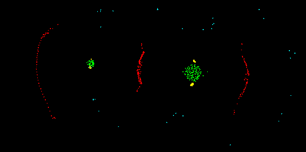
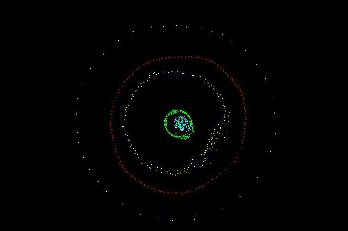
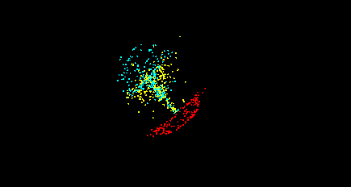

# Описание

MicroLife - симуляция предназначенная для наблюдения за формированием структур состоящих из четырех видов частиц, которые взаимодействуют друг с другом по определенным правилам. Правило определяет поведение между двумя типами частиц, их силу притяжения или отталкивания и дистанцию на которой это происходит. Пользователь может настраивать поведение симуляции через графический интерфейс.

# Технологии

- С++
- SFML
- IMGUI

# Пример структур

